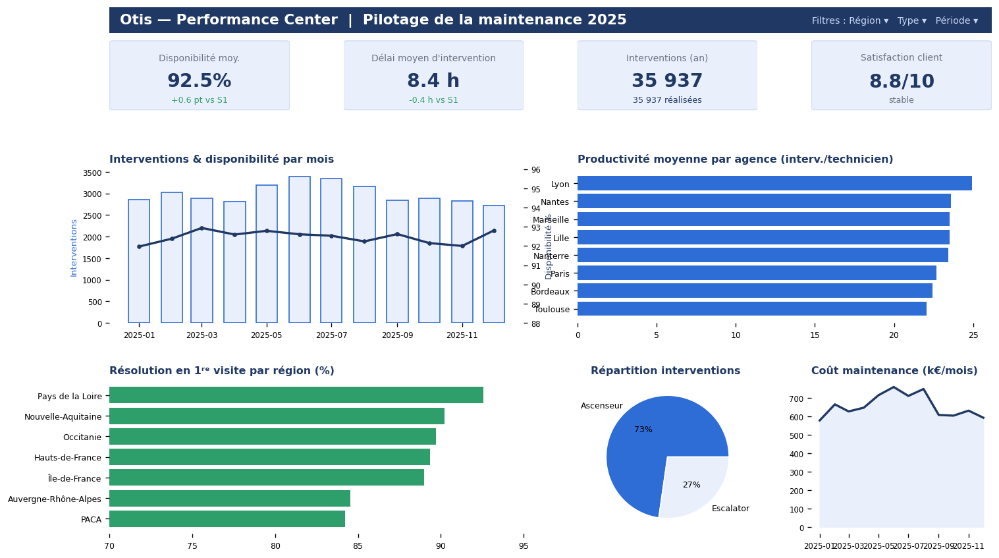

# Dashboard de performance opérationnelle — Looker Studio

https://datastudio.google.com/reporting/02b2f7e6-c90d-4bf0-b129-867db0e5ca75

Tableau de bord de pilotage construit sur des données d'exploitation mensuelles
(8 agences × 12 mois × 2 types d'équipement = 192 enregistrements).

**Contenu :** 4 KPIs (disponibilité, délai d'intervention, productivité, satisfaction),
5 visualisations et 3 filtres dynamiques (région, type, période).

**Démarche :** modélisation des indicateurs, fiabilisation des données en amont,
restitution claire orientée décision métier.

➡️ **Dashboard en ligne :** https://datastudio.google.com/reporting/02b2f7e6-c90d-4bf0-b129-867db0e5ca75

- `data.csv` — jeu de données
- `screenshot.png` — aperçu
